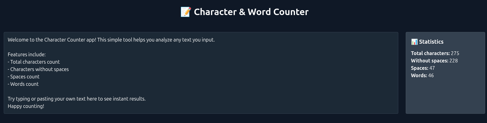

# 🧮 Character Counter App

Welcome to the **Character Counter** — your friendly, fast, and fun text analyzer! 🎉✨

## 🚀 Features

- 🔢 **Total Characters:** Counts every character you type.
- 🚫 **Characters Without Spaces:** Shows count excluding spaces.
- 🌬️ **Spaces Count:** Tracks how many spaces you’ve used.
- 📝 **Word Count:** Counts words for quick text insights.
- ⚡ **Real-Time Updates:** Instantly see stats as you type.
- 🎨 **Clean & Simple UI:** Easy to use and understand.
- 🌐 **Built with Svelte & Tailwind CSS:** Modern and lightning fast!

## 📸 Screenshot



## 🔗 Live Demo

Check it out live 👉 [Your App Link Here](https://mufasa-dev.github.io/character-counter/)

## 💡 How to Use

1. Paste or type your text in the text area.
2. Watch the character, space, and word counts update instantly.
3. Use it for writing, coding, social media posts, or anywhere text matters!

## 🛠️ Installation & Running Locally

```bash
git clone https://github.com/mufasa-dev/character-counter.git
cd character-counter
npm install
npm run dev
````

Then open [http://localhost:5173](http://localhost:5173) in your browser.

## 🙌 Contributing

Contributions, issues, and feature requests are welcome!

## 📄 License

This project is licensed under the MIT License.

---

Made with ❤️ and Svelte ✨
Happy counting! 🎉
